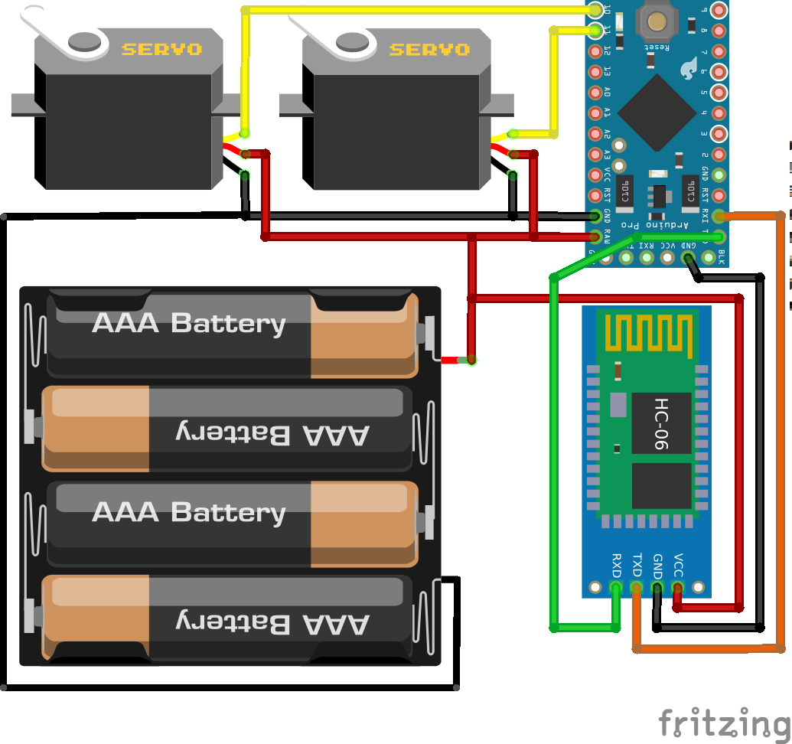
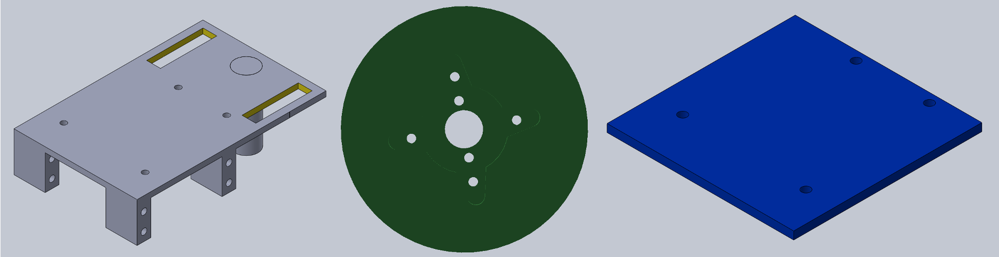

# [SquirlRob](https://github.com/ee09115/squirlrob)

## Overview

## Electronic Parts List
* HC-06 Bluetooth Module - [Ebay link](https://www.ebay.com/itm/1PCS-Slave-HC-06-Wireless-Bluetooth-Transeiver-RF-Master-Module-for-Arduino/201415076859?epid=817572491&hash=item2ee5462bfb:g:6GgAAOxyCQ5TlsHx)
* Arduino Pro Mini 3V3@8MHz - [Ebay link](https://www.ebay.com/itm/1PCS-Mini-ATMEAG328-3-3V-8Mhz-Replace-ATmega128-For-Arduino-Pro-Mini-Compatible/152110232869?epid=596327179&hash=item236a79f525:g:xdIAAOSwP~tW3jZ6)
* Batery Holder - [Ebay link](https://www.ebay.com/itm/New-1PC-4-AAA-Battery-1-5V-Holder-Box-Case-Storage-DIY-Test-Study-Tool-Converter/201105132105?hash=item2ed2ccca49:g:JToAAOxyrx5TlX~P)
* Futaba S3003 Servo Motor - [Ebay link](https://www.ebay.com/itm/Big-Torque-Futaba-S3003-Servo-Motor-Metal-Gear-for-RC-Helicopter-Robot-Align-T-R/222649123161?epid=1774208731&hash=item33d6ec0159:g:P98AAOSwdIFXxjDN)

## Chassis

## Android Application
